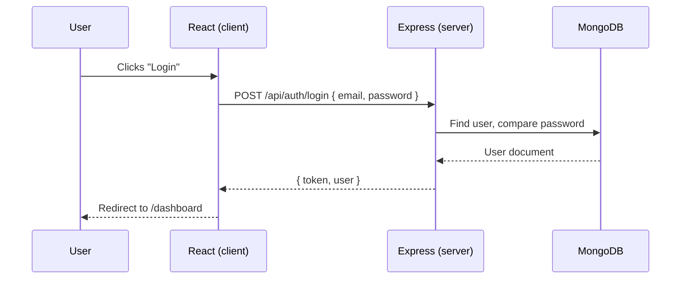
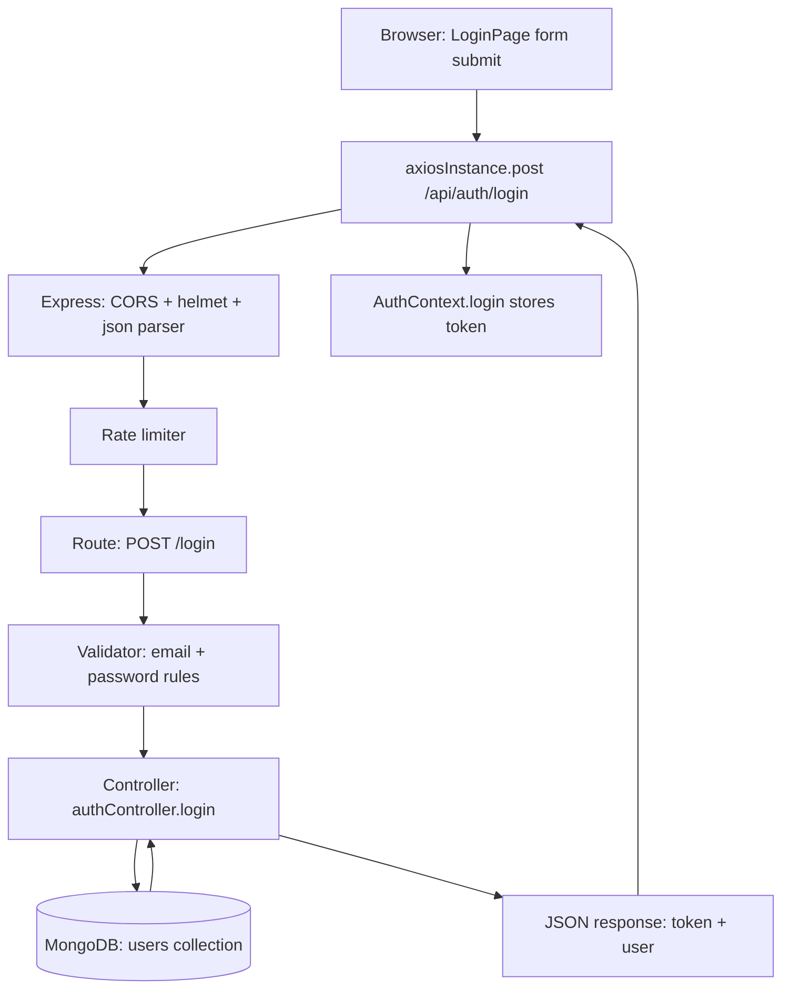
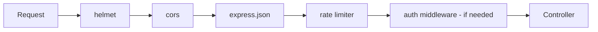
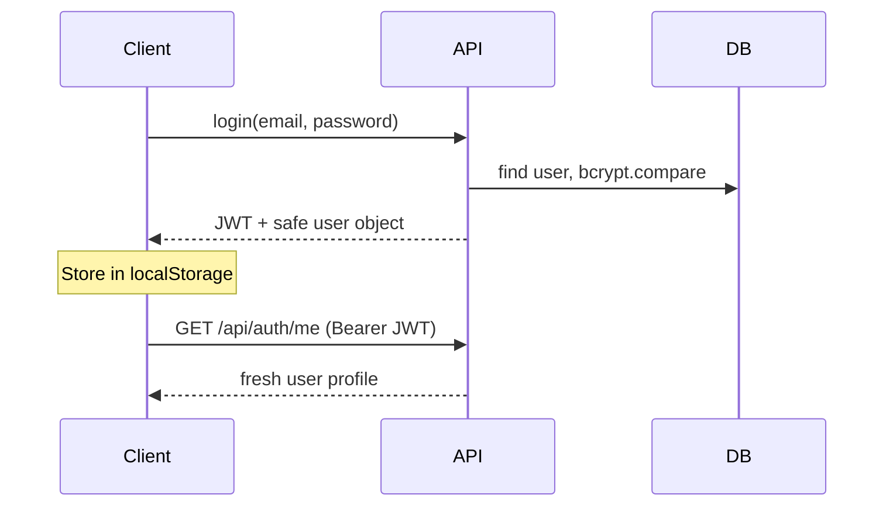
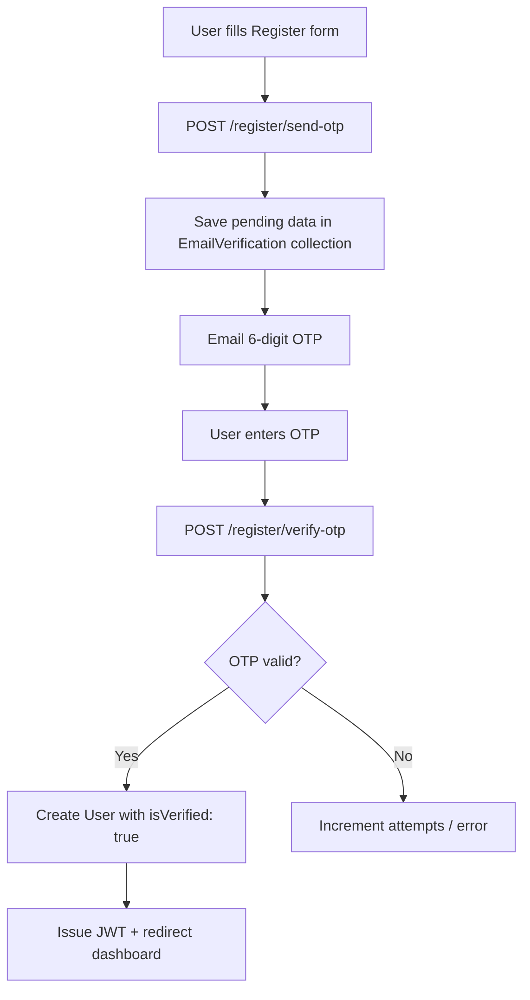
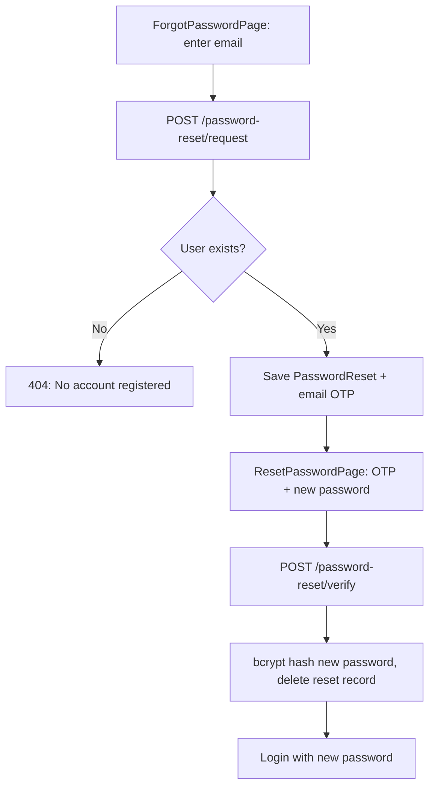
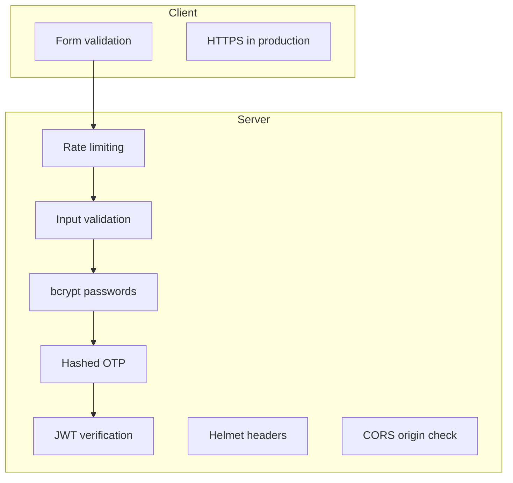
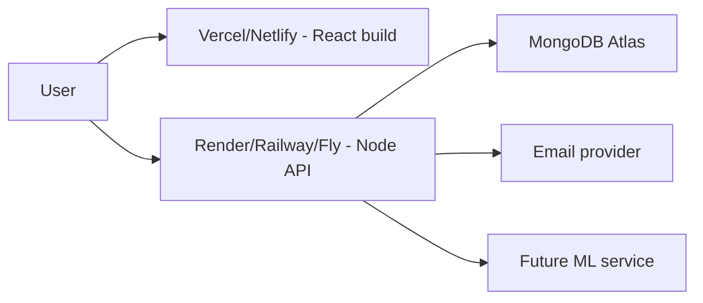
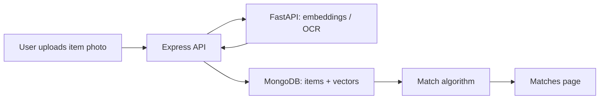

# Hawalay MERN Learning Handbook — Flow 0 → 1

> **Who this is for:** You are learning as an intern/junior developer on a real project.  
> **How to use this:** Read in order once, then use it as a reference while coding.  
> **Project:** Hawalay — AI-assisted lost & found platform (MERN monorepo).

---

## Table of Contents

1. [How to Think Like a Full-Stack Developer](#1-how-to-think-like-a-full-stack-developer)
2. [Project Architecture](#2-project-architecture)
3. [Backend Fundamentals](#3-backend-fundamentals)
4. [Authentication Deep Dive](#4-authentication-deep-dive)
5. [OTP & Email Verification System](#5-otp--email-verification-system)
6. [Frontend Deep Dive](#6-frontend-deep-dive)
7. [Database Concepts](#7-database-concepts)
8. [Security Concepts](#8-security-concepts)
9. [Production-Level Concepts](#9-production-level-concepts)
10. [Current Hawalay Features Explained](#10-current-hawalay-features-explained)
11. [Pending Features & Future Learning](#11-pending-features--future-learning)
12. [Your Learning Roadmap](#12-your-learning-roadmap)

---

## 1. How to Think Like a Full-Stack Developer

Before folders and files, understand the **big picture**:

| Layer | Hawalay example | Job |
|-------|-----------------|-----|
| **UI (React)** | Login page, Register OTP step | What the user sees and clicks |
| **API (Express)** | `POST /api/auth/login` | Business rules, security, validation |
| **Database (MongoDB)** | `users` collection | Long-term storage |

**Simple rule:** The browser never talks to MongoDB directly. It always goes through your API.



### What You Should Learn From This
- Full-stack means **coordinated layers**, not “React only” or “Node only.”
- Every feature has a **user action → API → database** path.

### Common Beginner Mistakes
- Putting database connection strings in React code.
- Trusting data from the frontend without server validation.
- Mixing all logic in one giant file.

### Industry Best Practices
- **Separation of concerns:** UI, API, data each have their job.
- Draw the request flow on paper before coding.

---

## 2. Project Architecture

### 2.1 MERN Monorepo Structure

```
fyp-hawalay/
├── package.json          # Root: workspaces + "npm run dev" for both apps
├── client/               # Frontend (hawalay-client)
│   ├── src/
│   │   ├── api/          # Axios HTTP client
│   │   ├── components/   # Reusable UI
│   │   ├── context/      # Auth global state
│   │   ├── pages/        # Route screens
│   │   └── ...
│   └── vite.config.js
└── server/               # Backend (hawalay-server)
    ├── app.js            # Express app setup
    ├── server.js         # Entry: env, DB, listen
    ├── routes/           # URL → handler mapping
    ├── controllers/      # Request logic
    ├── models/           # Mongoose schemas
    ├── services/         # Email, OTP helpers
    └── middleware/       # Auth, validation, limits
```

**Why client/server separation?**

- **Security:** Secrets (JWT secret, SMTP password, Mongo URI) stay on the server only.
- **Scaling:** You can deploy API and UI on different servers later.
- **Team workflow:** Frontend and backend can evolve independently.

### 2.2 npm Workspaces

Root `package.json`:

```json
"workspaces": ["client", "server"]
```

**Plain English:** One `npm install` at the root installs dependencies for both apps.

**Professional term:** **Monorepo** — multiple packages in one repository.

Hawalay scripts:

| Command | What it does |
|---------|----------------|
| `npm run dev` | Runs client + server together (`concurrently`) |
| `npm run dev:client` | Vite dev server (~5173) |
| `npm run dev:server` | Nodemon API (~5000) |

### 2.3 Environment Variables

| Location | Prefix | Examples |
|----------|--------|----------|
| `server/.env` | none | `MONGO_URI`, `JWT_SECRET`, `SMTP_HOST` |
| `client/.env` | `VITE_` | `VITE_API_URL`, `VITE_GOOGLE_CLIENT_ID` |

**Why `VITE_`?** Vite only exposes env vars to the browser if they start with `VITE_`. This prevents accidentally leaking server secrets.

**Hawalay:** `server/utils/validateEnv.js` checks required keys at startup — the server **refuses to start** if something critical is missing. That is production thinking.

### 2.4 Request Lifecycle (One API Call)

Example: User logs in.



**Key files:**

- Route: `server/routes/auth.js`
- Controller: `server/controllers/authController.js`
- Model: `server/models/User.js`

### 2.5 Frontend ↔ Backend Communication

- **Protocol:** HTTP/HTTPS
- **Format:** JSON (`Content-Type: application/json`)
- **Auth:** `Authorization: Bearer <JWT>` on protected calls
- **Client helper:** `client/src/api/axiosInstance.js`

```javascript
// Simplified idea from axiosInstance.js
axiosInstance.interceptors.request.use((config) => {
  const token = localStorage.getItem('auth_token');
  if (token) config.headers.Authorization = `Bearer ${token}`;
  return config;
});
```

### What You Should Learn From This
- Monorepo = one repo, multiple apps.
- Env vars separate **config from code**.
- Every API request passes through **middleware → route → controller → model**.

### Common Beginner Mistakes
- Committing `.env` to GitHub.
- Hardcoding `http://localhost:5000` in 20 files instead of `VITE_API_URL`.
- Calling MongoDB from React.

### Industry Best Practices
- `.env.example` in repo (no secrets), `.env` in `.gitignore`.
- Health check endpoint: Hawalay has `GET /health`.
- Fail fast on missing config at startup.

---

## 3. Backend Fundamentals

### 3.1 Express Server Setup

**Two files matter:**

| File | Role |
|------|------|
| `server/server.js` | Boots the process: load env, connect DB, listen on `PORT` |
| `server/app.js` | Configures Express: middleware, routes, error handler |

**Analogy:** `server.js` = turning on the restaurant. `app.js` = laying out kitchen rules and menu.

### 3.2 Middleware Concept

**Middleware** = functions that run **before** your route handler.



**Hawalay examples:**

| Middleware | File | Purpose |
|------------|------|---------|
| `helmet` | `app.js` | Security headers |
| `cors` | `app.js` | Only allow `CLIENT_URL` origin |
| `express.json` | `app.js` | Parse JSON body |
| `generalLimiter` | `rateLimiter.js` | Prevent abuse |
| `authMiddleware` | `authMiddleware.js` | Verify JWT |
| `registerValidation` | `authValidators.js` | Check input shape |

### 3.3 Route → Controller → Service Pattern

**Route** (`routes/auth.js`): “When someone hits this URL with this method, run these steps.”

```javascript
router.post('/login', authLimiter, loginValidation, handleValidationErrors, login);
```

Read right-to-left as a pipeline:

1. Rate limit
2. Validate body
3. If validation fails → 400
4. Else → `login` controller

**Controller** (`controllers/*.js`): Orchestrates the use case (find user, compare password, send response).

**Service** (`services/emailService.js`, `services/otpService.js`): Reusable logic not tied to HTTP (send email, generate OTP).

**Why split?** So `registrationController.js` and `passwordResetController.js` can both use `otpService.js` without duplicating code.

### 3.4 MongoDB Connection

`server/config/db.js` connects Mongoose to Atlas/local using `MONGO_URI`.

`server.js` waits for DB connection **before** accepting traffic — avoids “API up but DB down” confusion.

### 3.5 Mongoose Models

Models define **shape + rules** for documents.

**Hawalay models:**

| Model | Collection purpose |
|-------|-------------------|
| `User` | Registered accounts |
| `EmailVerification` | Pending signups (OTP not verified yet) |
| `PasswordReset` | Pending password resets |

### 3.6 Error Handling

`middleware/errorHandler.js` — central place for consistent error JSON (last middleware in `app.js`).

**Pattern:** Controllers call `next(err)` for unexpected errors; validation returns structured `400` with `errors[]`.

### 3.7 Validation

`express-validator` in `middleware/validators/authValidators.js`:

- Email format
- Password length + complexity
- OTP must be 6 digits
- `confirmPassword` must match `password`

`handleValidationErrors.js` converts validator output to:

```json
{ "errors": [{ "field": "email", "message": "Invalid email" }] }
```

Frontend maps this to field-level errors on Register/Login forms.

### 3.8 Rate Limiting

`authLimiter`: ~10 requests/minute on auth endpoints.  
`resendOtpLimiter`: stricter on resend (abuse prevention).

**Why?** Stops brute-force login and OTP spam.

### 3.9 Helmet & CORS

- **Helmet:** Sets HTTP headers that reduce common attacks (XSS, clickjacking, etc.).
- **CORS:** Browser blocks cross-origin requests unless the server explicitly allows your frontend origin (`CLIENT_URL`).

### What You Should Learn From This
- Routes are thin; controllers carry business logic; services are shared utilities.
- Middleware is the “security and hygiene” layer.
- Validation always happens on the **server**, even if React also validates.

### Common Beginner Mistakes
- Putting DB queries directly inside route files.
- Returning stack traces to clients in production.
- Skipping validation because “the frontend already checks.”

### Industry Best Practices
- Consistent error shape: `{ error: string }` or `{ errors: [...] }`.
- Layered architecture: routes / controllers / services / models.
- Rate limit anything that sends email or checks passwords.

---

## 4. Authentication Deep Dive

### 4.1 What Is Authentication vs Authorization?

| Term | Meaning | Hawalay example |
|------|---------|-----------------|
| **Authentication** | Who are you? | Login, JWT |
| **Authorization** | What can you do? | Private routes, future roles |

### 4.2 JWT (JSON Web Token)

After successful login/register-verify, server returns a **token** string.

**Payload (simplified):** `{ userId, email, exp }`  
**Signed with:** `JWT_SECRET` (only server knows this)

**Hawalay:** `server/utils/authTokens.js` → `signAccessToken(user)` with **10 minute** expiry.



### 4.3 Why JWT Instead of Sessions?

| Sessions (server-side) | JWT (stateless) |
|------------------------|-----------------|
| Server stores session ID | Server verifies signature only |
| Easy to revoke all sessions | Revoke harder (need blocklist or short expiry) |
| Common in traditional apps | Common in SPAs + mobile APIs |

**Hawalay choice:** JWT fits SPA + REST. Short expiry (10m) limits damage if token leaks.

### 4.4 Auth Middleware

`server/middleware/authMiddleware.js`:

1. Read `Authorization: Bearer <token>`
2. `jwt.verify(token, JWT_SECRET)`
3. Attach `req.user = { userId, email }`
4. Call `next()` or return 401

**Global protection in `app.js`:** All routes except `/api/auth/*` require JWT (future item/report APIs will be protected automatically).

### 4.5 Password Hashing (bcrypt)

**Never store plain passwords.**

```javascript
// Registration / reset (conceptual)
const passwordHash = await bcrypt.hash(password, 10);
// Login
const match = await bcrypt.compare(password, user.passwordHash);
```

**Salt rounds (10):** Work factor — higher = slower brute force, more CPU.

### 4.6 Google OAuth Flow

**Why OAuth?** User signs in with Google; you trust Google verified their email.

**Hawalay flow:**

1. Client gets Google token (`GoogleAuthButton` or `useGoogleLogin`)
2. `POST /api/auth/google` with `{ token }`
3. Server verifies via Google library or userinfo API
4. Find or create user with `authProvider: 'google'`, `isVerified: true`
5. Return JWT

**File:** `server/controllers/authController.js` → `googleAuth`

### 4.7 Protected Routes (Frontend)

`PrivateRoute.jsx`:

```javascript
if (user == null) return <Navigate to="/login" />;
return <Outlet />; // render child routes
```

Wrapped in `App.jsx` around `/dashboard`, `/report`, etc.

### 4.8 AuthContext

`client/src/context/AuthContext.jsx` provides:

- `user`, `token`
- `login(token, user)`, `logout()`
- On app load: decode JWT expiry → call `/api/auth/me` → refresh user or logout

**Why Context?** Any component can `useAuth()` without prop drilling.

### What You Should Learn From This
- Login = prove identity → receive JWT → send JWT on later requests.
- Passwords are hashed; tokens are signed, not encrypted secrets.
- OAuth delegates identity to Google for users who prefer that.

### Common Beginner Mistakes
- Storing passwords in JWT payload.
- Putting JWT in URL query strings (leaks in logs/history).
- Never expiring tokens.
- Trusting `localStorage` user object without re-fetching `/me`.

### Industry Best Practices
- Use `httpOnly` cookies for tokens in high-security apps (Hawalay uses localStorage for SPA simplicity — know the tradeoff).
- Short-lived access tokens; refresh tokens for longer sessions (future improvement).
- `toSafeObject()` on User model strips `passwordHash` before sending to client.

---

## 5. OTP & Email Verification System

Hawalay uses **OTP (One-Time Password)** — a 6-digit code emailed to the user.

### 5.1 Why Verify Before Account Creation?

**Problem without verification:** Anyone can register with someone else's email.

**Hawalay registration flow:**



**Key idea:** `User` document is created **only after** OTP success.

**Files:**

- Model: `server/models/EmailVerification.js`
- Controller: `server/controllers/registrationController.js`
- UI: `client/src/pages/auth/RegisterPage.jsx` (steps: `details` → `verify`)

### 5.2 Forgot Password OTP Flow

Similar pattern, different collection:



**Files:**

- Model: `server/models/PasswordReset.js`
- Controller: `server/controllers/passwordResetController.js`
- UI: `ForgotPasswordPage.jsx`, `ResetPasswordPage.jsx`

### 5.3 SMTP & Gmail Setup

`server/services/emailService.js` uses **nodemailer**.

| Env var | Purpose |
|---------|---------|
| `SMTP_HOST` | e.g. `smtp.gmail.com` |
| `SMTP_PORT` | `587` |
| `SMTP_USER` | Gmail address |
| `SMTP_PASS` | **App Password** (not normal Gmail password) |
| `SMTP_FROM` | Display name in inbox |
| `EMAIL_VERIFICATION_DEV_LOG=true` | Print OTP in terminal (no SMTP needed locally) |

### 5.4 OTP Generation & Hashing

`server/services/otpService.js`:

- `generateOtp()` — cryptographically secure 6 digits
- `hashOtp(otp)` — bcrypt before saving to DB
- `verifyOtp(otp, otpHash)` — compare at verification time

**Why hash OTP?** If database leaks, attacker still cannot use codes.

### 5.5 Expiry & TTL

- **OTP validity:** `OTP_EXPIRY_MINUTES` (default 10) — shown in email and UI.
- **MongoDB TTL index** on `otpExpiresAt` — auto-deletes expired pending records.

### 5.6 Resend & Cooldown

| Rule | Value | Purpose |
|------|-------|---------|
| Resend cooldown | 60 seconds | Stop email bombing |
| Max resends | 5 | Limit abuse |
| Max verify attempts | 5 | Limit OTP guessing |

**UI:** Register and Reset pages show `Resend code in 59s…`

**Important distinction (you asked about this before):**

- **60s** = wait before *another* email
- **10 min** = current code stops working

### What You Should Learn From This
- OTP proves **email ownership** before sensitive actions.
- Pending state lives in separate collections, not in `User`.
- Security = hash + expiry + rate limits + attempt caps.

### Common Beginner Mistakes
- Storing OTP plain text in MongoDB.
- Same message for “user not found” and “wrong OTP” when you need clarity (Hawalay forgot-password now tells you if email isn’t registered).
- No resend cooldown → SMTP quota exhaustion.

### Industry Best Practices
- Professional HTML email templates (Hawalay `buildOtpEmailHtml`).
- Generic messages where enumeration is a risk; explicit messages where product requires it (forgot password).
- Invalidate OTP after successful use (delete `PasswordReset` / `EmailVerification` doc).

---

## 6. Frontend Deep Dive

### 6.1 React + Vite

**React:** Component-based UI.  
**Vite:** Fast dev server and build tool (replaces older Create React App).

Entry: `client/src/main.jsx` → renders `App.jsx`.

### 6.2 Routing

`react-router-dom` in `App.jsx`:

| Path | Access |
|------|--------|
| `/login`, `/register`, `/forgot-password`, `/reset-password` | Public |
| `/dashboard`, `/report`, … | `PrivateRoute` |

`AppLayout` wraps routes with `Navbar` for consistent chrome.

### 6.3 Component Structure

```
components/
├── auth/          # GoogleAuthButton, AuthFooter
├── layout/        # Navbar, AppLayout
├── routing/       # PrivateRoute
├── ui/            # Button, Spinner, Logo export
└── items/         # ItemCard (dashboard)
pages/
└── auth/          # Login, Register, Forgot, Reset
```

**Rule of thumb:**

- **Pages** = full screens tied to routes.
- **Components** = reusable pieces.

### 6.4 State Management

Hawalay uses **React Context** for auth (`AuthContext`), **useState** for forms.

No Redux yet — appropriate for current size.

**Form state example (Register):**

```javascript
const [email, setEmail] = useState('');
const [step, setStep] = useState('details'); // 'details' | 'verify'
```

### 6.5 Axios Instance

Single configured client: `api/axiosInstance.js`

- Base URL from env
- Attaches JWT automatically
- On 401 (except login/register): clear storage → redirect `/login`

### 6.6 UI/UX Patterns in Hawalay

| Pattern | Where |
|---------|-------|
| Glass panel cards | Login, Register forms |
| Floating labels | Auth form inputs |
| Error / success alert boxes | `bg-error-container`, `bg-primary-container` |
| Loading on buttons | `<Button loading={submitting}>` |
| Material Symbols icons | Google, visibility, navigation |

### 6.7 Branding: Logo Component

`components/Logo.jsx` imports `icon.svg` via Vite `?url`.

Used on: splash, login hero, register hero, navbar, several headers.

**Why one component?** Change logo once → updates everywhere.

### 6.8 Shared AuthFooter

`components/auth/AuthFooter.jsx` — same footer on Login/Register with variant prop (`login` | `register`).

### What You Should Learn From This
- Pages orchestrate; components render; context shares auth globally.
- Router guards (`PrivateRoute`) mirror backend JWT checks.
- One Axios instance avoids copy-paste interceptors.

### Common Beginner Mistakes
- Fetch API in every component with duplicated headers.
- Storing password in React state after submit (ok during form, never log it).
- Giant components (300+ lines) with no extraction — refactor when painful.

### Industry Best Practices
- Design tokens via Tailwind config (`tailwind.config.js`).
- Accessible forms: `label`, `role="alert"`, `aria-busy`.
- Environment-based API URL for staging/production builds.

---

## 7. Database Concepts

### 7.1 MongoDB Basics

**NoSQL document database:**

- **Database:** `fyp-hawalay` (from connection string)
- **Collection:** like a table (`users`, `emailverifications`, `passwordresets`)
- **Document:** one JSON-like record

### 7.2 Why NoSQL for Hawalay?

- Flexible schema while features evolve (push subscription object, future item metadata).
- Natural fit for JSON APIs.
- Atlas hosting is straightforward for student/production projects.

### 7.3 User Schema Highlights

`server/models/User.js`:

| Field | Purpose |
|-------|---------|
| `email` | Unique login identifier |
| `passwordHash` | bcrypt output (null for Google-only) |
| `authProvider` | `local` \| `google` |
| `googleId` | Sparse unique for OAuth |
| `isVerified` | Email verified for local accounts |
| `isActive` | Soft disable (future admin) |

`toSafeObject()` removes `passwordHash` before API responses.

### 7.4 Pending Collections

**EmailVerification** — holds `name`, `passwordHash`, `otpHash`, `otpExpiresAt` until registration completes.

**PasswordReset** — holds `otpHash`, expiry for forgot-password only.

**Why separate?** User table stays clean; incomplete signups can expire automatically.

### 7.5 Common Mongoose Operations in Hawalay

```javascript
User.findOne({ email })
User.create({ ... })
EmailVerification.findOneAndUpdate({ email }, { ... }, { upsert: true })
PasswordReset.deleteOne({ _id })
```

### What You Should Learn From This
- Collections map to models in Mongoose.
- Not everything belongs in `User` — temporary flows get temporary collections.
- Indexes (`unique`, TTL) enforce data rules at DB level.

### Common Beginner Mistakes
- Duplicating email in two places without unique index.
- Saving plain OTP or plain password.
- No expiry on temporary tokens.

### Industry Best Practices
- Sparse unique index for optional fields like `googleId`.
- Timestamps `{ timestamps: true }` for auditing.
- Connection pooling via Mongoose (default).

---

## 8. Security Concepts

### 8.1 Secrets & Git

**Never commit:**

- `server/.env`
- `client/.env`

**Do commit:**

- `.env.example` with placeholder keys

### 8.2 Defense Layers in Hawalay



### 8.3 Threat Quick Reference

| Threat | Mitigation in Hawalay |
|--------|----------------------|
| Brute force login | Rate limiter |
| OTP guessing | 5 attempts, expiry |
| SQL injection | N/A (MongoDB); still validate inputs |
| XSS | React escapes by default; helmet |
| Token theft | Short JWT expiry, logout clears storage |
| Email enumeration | Registration: generic; Forgot password: explicit “not registered” (product choice) |

### What You Should Learn From This
- Security is **layers**, not one feature.
- Hash everything sensitive at rest (passwords, OTPs).

### Common Beginner Mistakes
- `JWT_SECRET = "secret123"`
- Logging request bodies with passwords in production.
- Disabling CORS `*` in production.

### Industry Best Practices
- Rotate secrets if leaked.
- Principle of least privilege on MongoDB Atlas IP whitelist.
- Use App Passwords / transactional email providers for SMTP.

---

## 9. Production-Level Concepts

### 9.1 Development vs Production

| Aspect | Dev | Production |
|--------|-----|------------|
| API URL | `localhost:5000` | `https://api.yourdomain.com` |
| Client | Vite dev server | Static build on CDN/hosting |
| Env | `.env` local | Host env vars / secrets manager |
| Logs | `morgan('dev')` | `morgan('combined')` + log aggregator |
| OTP email | `EMAIL_VERIFICATION_DEV_LOG` | Real SMTP (SendGrid, etc.) |

### 9.2 Deployment Sketch



### 9.3 CORS in Production

Update `CLIENT_URL` to your real frontend URL (`https://hawalay.app`).

### 9.4 Scalability Notes (Future)

- Stateless API (JWT) → horizontal scaling behind load balancer.
- Move email to queue (Bull/Redis) if volume grows.
- Separate FastAPI service for AI (already env-planned: `FASTAPI_URL`).

### 9.5 Clean Code in This Repo

- Controllers per domain (auth, registration, passwordReset)
- Shared `otpService`, `emailService`, `authTokens`
- Validators separated from business logic
- ESLint + Prettier enforced

### What You Should Learn From This
- Production is different config, not different code structure.
- Build client with `npm run build -w hawalay-client` → static files.

### Common Beginner Mistakes
- Deploying without setting env vars on host.
- Using dev Google OAuth origins in production.
- Forgetting to whitelist production server IP on Atlas.

### Industry Best Practices
- CI/CD: lint + test before deploy.
- Health check monitoring on `/health`.
- Separate staging environment.

---

## 10. Current Hawalay Features Explained

### 10.1 Login

| Step | Implementation |
|------|----------------|
| UI | `LoginPage.jsx` |
| API | `POST /api/auth/login` |
| Checks | User exists, `isVerified`, bcrypt match |
| Result | JWT + `user.toSafeObject()` |
| Google | `GoogleLoginButton` → `POST /api/auth/google` |

### 10.2 Registration (OTP)

| Step | Implementation |
|------|----------------|
| Step 1 UI | Name, email, password → `send-otp` |
| Email | `sendVerificationOtpEmail` |
| Step 2 UI | 6-digit OTP → `verify-otp` |
| DB | Creates `User`, deletes `EmailVerification` |

### 10.3 Forgot Password (OTP)

| Step | Implementation |
|------|----------------|
| Request | `ForgotPasswordPage` → `password-reset/request` |
| Exists check | 404 if email not in `users` |
| Reset UI | `ResetPasswordPage` → verify + new password |
| Security | Deletes `PasswordReset` after success |

### 10.4 Auth Context + Private Routes

- Token in `localStorage` keys: `auth_token`, `auth_user`
- Refresh user on load via `/api/auth/me`
- `PrivateRoute` blocks dashboard until logged in

### 10.5 API Auth Endpoints Cheat Sheet

| Method | Path | Auth required |
|--------|------|---------------|
| POST | `/api/auth/register/send-otp` | No |
| POST | `/api/auth/register/verify-otp` | No |
| POST | `/api/auth/register/resend-otp` | No |
| POST | `/api/auth/login` | No |
| POST | `/api/auth/google` | No |
| POST | `/api/auth/password-reset/request` | No |
| POST | `/api/auth/password-reset/resend-otp` | No |
| POST | `/api/auth/password-reset/verify` | No |
| GET | `/api/auth/me` | Yes (Bearer) |

### 10.6 What Is Still UI-Only (Mock)

These pages exist but backend integration is future work:

- Dashboard, Report, Matches, Chat, Notifications, Profile, Item details, Offline

Reference: `constants/mockData.js`, console.log submits on Report page.

### What You Should Learn From This
- Auth is fully wired; core product features are the next sprint.
- Trace any feature using: **Page → axios call → route → controller → model**.

### Common Beginner Mistakes
- Assuming dashboard data is real because it looks polished.
- Changing API URL only in one file.

### Industry Best Practices
- Feature flags for unfinished modules.
- OpenAPI/Swagger docs for auth routes (future).

---

## 11. Pending Features & Future Learning

### 11.1 AI Matching (FastAPI)

**Env:** `FASTAPI_URL`, `HF_TOKEN`

**Likely flow:**



**Learn:** REST between services, async jobs, file upload handling, vector search basics.

### 11.2 Push Notifications (VAPID)

**Env already present:** `VAPID_PUBLIC_KEY`, `VAPID_PRIVATE_KEY`, `VAPID_EMAIL`

**Concept:** Service Worker in browser subscribes → server stores `pushSubscription` on User → sends notifications via `web-push` library.

### 11.3 PWA & Offline

`OfflineExperiencePage.jsx`, `useOfflineQueue.js` hint at:

- Service worker caching
- Queue actions when offline, sync when online

**Learn:** Progressive Web Apps, background sync.

### 11.4 Real-Time Chat

**Options:**

| Approach | Pros |
|----------|------|
| Socket.io | Bidirectional, rooms |
| Firebase | Managed, fast MVP |
| Polling | Simple, inefficient |

`ChatPage.jsx` today is static UI.

### 11.5 Item Reporting API

`ReportPage.jsx` needs:

- `POST /api/items` with multipart image
- Validation, storage (S3/Cloudinary)
- Link to user ID from JWT

### What You Should Learn From This
- Hawalay auth is the foundation; feature modules plug into the same patterns.
- ML and real-time are **separate skills** you’ll add on top of solid CRUD + auth.

### Common Beginner Mistakes
- Building AI before basic item CRUD works.
- WebSockets everywhere when REST polling is enough for MVP.

### Industry Best Practices
- Microservice only when team/size justifies it (FastAPI for Python ML is a good split).
- Define API contracts between Express and FastAPI early.

---

## 12. Your Learning Roadmap

### Phase 1 — You are here ✅
- [x] MERN structure
- [x] JWT auth
- [x] Registration OTP
- [x] Forgot password OTP
- [x] Google OAuth
- [x] Shared UI patterns

### Phase 2 — Core product
- [ ] Items CRUD (lost/found)
- [ ] Image upload
- [ ] User profile API (real data)
- [ ] Connect Dashboard to API

### Phase 3 — Intelligence
- [ ] FastAPI integration
- [ ] Matching pipeline
- [ ] Notifications

### Phase 4 — Production hardening
- [ ] Refresh tokens
- [ ] Tests (Jest/Supertest, Vitest)
- [ ] CI/CD
- [ ] Deploy client + server
- [ ] Monitoring & logging

### Weekly Exercises (Do These)

1. **Trace a request:** Pick `verify-otp` and list every file from button click to DB write.
2. **Break and fix:** Temporarily wrong `JWT_SECRET` — observe 401 behavior.
3. **Add a field:** Add `phone` to User (schema + validator + form) — practice full-stack change.
4. **Read MongoDB:** Inspect `users`, `emailverifications` in Atlas after test signup.
5. **Draw diagrams:** Redraw registration flow from memory; compare to Section 5.

---

## Quick Reference: Important Files

| Topic | Path |
|-------|------|
| API entry | `server/server.js`, `server/app.js` |
| Auth routes | `server/routes/auth.js` |
| Login logic | `server/controllers/authController.js` |
| Register OTP | `server/controllers/registrationController.js` |
| Forgot password | `server/controllers/passwordResetController.js` |
| User model | `server/models/User.js` |
| Email | `server/services/emailService.js` |
| OTP utils | `server/services/otpService.js` |
| Validators | `server/middleware/validators/authValidators.js` |
| React routes | `client/src/App.jsx` |
| Auth state | `client/src/context/AuthContext.jsx` |
| HTTP client | `client/src/api/axiosInstance.js` |
| Route guard | `client/src/components/routing/PrivateRoute.jsx` |

---

## Final Words From Your Senior Dev Mentor

You are not “just making a student project.” Hawalay already uses patterns real teams use:

- layered backend,
- hashed secrets,
- OTP with expiry,
- rate limits,
- env validation,
- shared auth context,
- monorepo tooling.

**When stuck, ask in this order:**

1. What should the user see?
2. Which API endpoint handles it?
3. Which controller and model?
4. What does MongoDB store?

If you can answer those four questions for any feature, you understand the system.

Keep this file open. Update it when you add Items API, FastAPI, or chat — your future self will thank you.

---

*Document: Flow0-1.md — Hawalay MERN learning handbook*  
*Last aligned with codebase: auth, OTP registration, OTP password reset, Google OAuth, shared footer & branding.*
