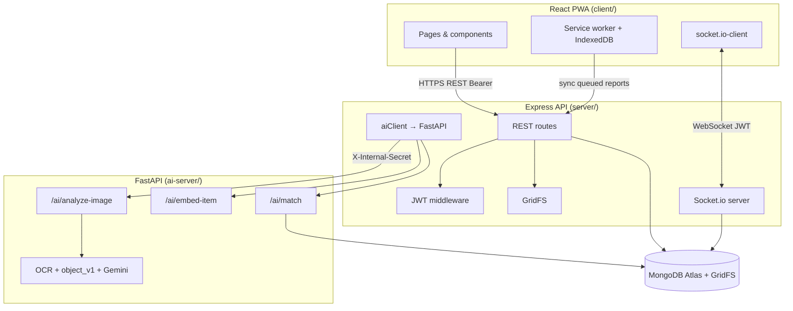
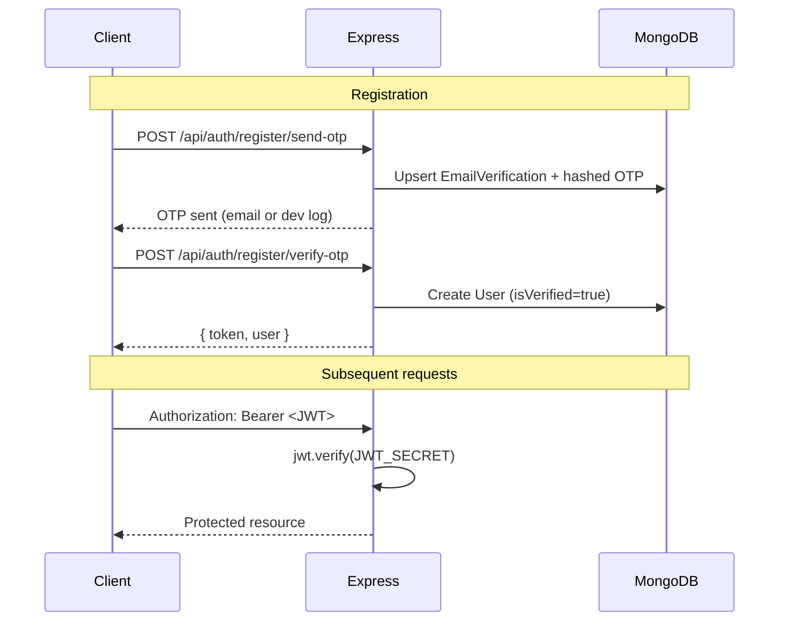

# Hawalay

[](https://nodejs.org/)
[](https://react.dev/)
[](https://www.python.org/)
[](https://www.mongodb.com/)

**Hawalay** is an AI-assisted lost-and-found platform. Users report lost or found items with photos and location, receive semantic match suggestions, chat in-app, and track return verification.

Final Year Project (FYP) monorepo:

| Service | Directory | Default port |
|---------|-----------|--------------|
| React PWA | `client/` | 5173 |
| Express API | `server/` | 5000 |
| FastAPI AI | `ai-server/` | 8000 (7860 in Docker / Hugging Face) |

---

## Table of Contents

- [Project Overview](#project-overview)
- [Features](#features)
- [Technology Stack](#technology-stack)
- [System Architecture](#system-architecture)
- [Folder Structure](#folder-structure)
- [Installation](#installation)
- [Environment Variables](#environment-variables)
- [Authentication](#authentication)
- [Database](#database)
- [AI Pipeline](#ai-pipeline)
- [Matching Engine](#matching-engine)
- [Offline & PWA](#offline--pwa)
- [Security](#security)
- [Deployment](#deployment)
- [Documentation](#documentation)

---

## Project Overview

### Problem

Community lost-and-found reporting is fragmented. Text-only listings make it hard to match visually similar items, and sensitive documents (CNIC, payment cards) must not expose private data in public listings.

### Solution

Hawalay combines:

1. A **React PWA** for reporting, browsing, chat, and notifications.
2. An **Express API** for auth, items, matches, real-time messaging, and GridFS image storage.
3. A **FastAPI AI sidecar** for OCR, object classification, Gemini captioning, embeddings, and background matching.

The browser talks only to Express. Express proxies AI calls to FastAPI using a shared internal secret.

---

## Features

### Authentication & account

- Email/password registration with **email OTP verification**
- Login with JWT access token (Bearer header, stored in `localStorage`)
- **Google OAuth** (optional — requires `GOOGLE_CLIENT_ID` / `VITE_GOOGLE_CLIENT_ID`)
- Password reset via email OTP
- Profile: name, email, bio, avatar (GridFS), change password
- No refresh tokens, no admin panel, no role-based admin UI

### Items & reporting

- Single-page **report form** (`/report`) with sections: report type, photo + AI analyze, item details, location, review
- Report types: **lost** / **found**
- Categories: Electronics, Clothing, Documents, Accessories, Other
- Primary and optional secondary location (GeoJSON `Point`, Leaflet + OpenStreetMap)
- Item statuses: `active`, `claimed`, `expired`, `returned`
- Soft delete (`isDeleted`)
- Authenticated GridFS image streaming (`GET /api/items/:id/image`)
- Community browse feed with filters (`/matches`)
- Dashboard for the signed-in user's items (`/dashboard`)
- Item detail page with map (`/item/:id`)
- Community stats card (`GET /api/stats/community`)

### AI-assisted reporting

- **Analyze image** on upload: object detection (13-class Keras model), OCR (EasyOCR + optional YOLO regions), Gemini caption and feature bullets
- Form autofill: title, brand, category, distinctive features
- **Sensitive document protection** for CNIC and payment cards: region blur on stored images, masked OCR text in API responses, card numbers show last 3 digits only
- **Matching embeddings** built at **submit time** via `POST /ai/embed-item` (not during analyze preview)

### Matching

- Background job after item create: Express → `POST /ai/match` → cosine similarity ranking
- Per-item AI match view (`/matches/ai/:itemId`) and aggregated view (`/my-matches`)
- In-app notifications and Socket.io `match:found` events
- **Return verification**: finder confirms return, owner confirms receipt (`POST /api/matches/:matchId/confirm-return`)

### Real-time chat

- Socket.io chat rooms keyed by match ID
- REST inbox: room list and message history
- Typing indicators, read receipts, unread counts in navbar
- Events: `chat:join`, `chat:send`, `chat:message`, `chat:typing`, `chat:read`, `chat:notify`, `chat:error`

### Notifications

- Types: `match_found`, `system`, `return_finder_confirmed`, `return_owner_confirmed`, `return_completed`
- Unread count, mark one read, mark all read

### PWA & offline

- Web manifest, service worker (`client/public/sw.js`)
- Install prompt in navbar
- Offline report queue in **IndexedDB**; service worker drains queue on reconnect / background sync
- Offline hub page (`/offline`)

### Partially implemented

- **Web push notifications**: server supports VAPID + `web-push` when keys are configured, but the client has no subscription UI — push only fires if `User.pushSubscription` is set manually.

### Not implemented

- Admin dashboard
- Refresh tokens / cookie sessions
- Google Maps (maps use Leaflet + OpenStreetMap)
- Client usage of legacy helpers `processItemImage()` and `extractDocumentOcr()` (API wrappers exist; report flow uses `analyzeImage()` only)

---

## Technology Stack

### Frontend (`client/`)

| Area | Libraries |
|------|-----------|
| Framework | React 18, Vite 6 |
| Routing | React Router 6 |
| Styling | Tailwind CSS 3, Framer Motion |
| HTTP | Axios |
| Maps | Leaflet, react-leaflet, OpenStreetMap tiles |
| Real-time | socket.io-client 4 |
| PWA | Service worker, IndexedDB (`idb`) |
| Auth UI | @react-oauth/google, jwt-decode |

### Backend (`server/`)

| Area | Libraries |
|------|-----------|
| Runtime | Node.js 18+ (client engine: 20.x) |
| API | Express 4 |
| Database | Mongoose 8, MongoDB |
| Auth | jsonwebtoken, bcrypt, google-auth-library |
| Upload / images | Multer, Sharp, GridFS |
| Real-time | Socket.io 4 |
| Security | Helmet, CORS, express-rate-limit, express-validator |
| Email | Nodemailer |
| Push (optional) | web-push |

### AI server (`ai-server/`)

| Area | Libraries |
|------|-----------|
| API | FastAPI, Uvicorn, Pydantic Settings |
| OCR | EasyOCR, Ultralytics YOLO (optional) |
| Object detection | TensorFlow 2.20, Keras 3.12 (`object_v1`, 13 classes) |
| Vision / embeddings | Google Gemini (`google-genai`) |
| Database (matching) | Motor (async MongoDB) |

---

## System Architecture



### Request flow (report with AI)

1. User uploads photo on `/report` → `POST /api/items/analyze-image` (Express, JWT + Multer).
2. Express forwards to FastAPI `POST /ai/analyze-image`.
3. Pipeline: optional YOLO/EasyOCR → sensitivity check → optional `object_v1` → Gemini caption/features.
4. Express masks sensitive fields, suggests category, returns autofill payload to client.
5. On submit → `POST /api/items` → Express calls `POST /ai/embed-item`, stores item + embedding, masks sensitive image for GridFS.
6. Express triggers `POST /ai/match` asynchronously → persists `Match` + `Notification` → Socket.io push.

---

## Folder Structure

```
fyp-hawalay/
├── client/                    # React PWA (Vite)
│   ├── public/                # sw.js, manifest, icons
│   └── src/
│       ├── api/               # Axios service modules
│       ├── components/        # UI, chat, report, layout, PWA
│       ├── context/           # Auth, PWA install
│       ├── hooks/             # offline queue, report draft
│       ├── pages/             # Route screens
│       ├── socket/            # Socket.io client
│       └── utils/             # analyze normalization, offline sync, geocode
├── server/                    # Express REST + Socket.io
│   ├── controllers/
│   ├── middleware/            # auth, rate limit, validators, upload
│   ├── models/                # User, Item, Match, Message, Notification, OTP
│   ├── routes/
│   ├── services/              # AI client, matching, email, push, return verification
│   └── utils/                 # category mapping, sensitive masking, GridFS
├── ai-server/                 # FastAPI microservice
│   ├── routers/               # ai, ocr, object, matching, health, blip, clip
│   ├── core/                  # pipeline orchestrator, model registry, detectors
│   ├── providers/             # Gemini, YOLO OCR, object detect
│   ├── services/
│   ├── artifacts/
│   │   └── object_v1/         # class_names.json, category_map.json, weights (gitignored)
│   ├── Dockerfile             # Hugging Face / container deploy
│   └── main.py
├── package.json               # npm workspaces root scripts
└── vercel.json                # Client deploy (Vercel)
```

`OCR_Model/` (local YOLO training, gitignored) and `*.keras` / `*.pt` weight files are not in Git — mount or upload at deploy time.

---

## Installation

### Prerequisites

- Node.js 18+ (20.x recommended — see `client/package.json` engines)
- npm 9+
- MongoDB (Atlas or local)
- Python 3.11+ for `ai-server/` (TensorFlow 2.20 wheels)
- Google Gemini API key — [Google AI Studio](https://aistudio.google.com/apikey)
- Optional: YOLO `best.pt` for card/CNIC region OCR; `hawalay_final_model.keras` for object classification

### Clone and install

```bash
git clone https://github.com/BabarAli-67/fyp-hawalay.git
cd fyp-hawalay
npm install
```

### Environment files

Copy templates and fill values:

| Service | Template | Output |
|---------|----------|--------|
| API | `server/.env.example` | `server/.env` |
| Client | `client/.env.example` | `client/.env` |
| AI | `ai-server/.env.example` | `ai-server/.env` |

`INTERNAL_SECRET` must match between `server/.env` and `ai-server/.env`.

### AI server

```bash
cd ai-server
python -m venv venv
# Windows: venv\Scripts\activate
# macOS/Linux: source venv/bin/activate
python -m pip install -r requirements.txt
copy .env.example .env   # cp on Unix
python main.py
```

Verify: `GET http://127.0.0.1:8000/health` → `gemini_client_initialized: true`

Place model weights (not in Git):

- `ai-server/artifacts/object_v1/weights/hawalay_final_model.keras`
- Optional YOLO: path set in `YOLO_WEIGHTS_PATH`

See `ai-server/.env.example` for Gemini, matching, and model path options.

### Run development stack

From repository root:

```bash
npm run dev        # client + Express
npm run dev:all    # client + Express + AI server
```

| Service | URL |
|---------|-----|
| Client | http://localhost:5173 |
| API | http://localhost:5000 |
| AI | http://127.0.0.1:8000 |

**Start order:** AI server → Express → client (Express probes AI health at startup).

### npm scripts

| Script | Description |
|--------|-------------|
| `npm run dev` | Client + server (concurrently) |
| `npm run dev:all` | Client + server + AI server |
| `npm run dev:client` | Vite dev server |
| `npm run dev:server` | Express with nodemon |
| `npm run dev:ai` | `python main.py` in ai-server |
| `npm run build:client` | Production build → `client/dist/` |
| `npm run start:server` | Production Express |

---

## Environment Variables

Only variables referenced in code are listed. See `.env.example` files for comments.

### Express (`server/`)

| Variable | Required | Description |
|----------|----------|-------------|
| `PORT` | No (default 5000) | HTTP port |
| `CLIENT_URL` | Yes* | CORS allowlist origin(s); comma-separated |
| `CLIENT_URLS` | No | Additional CORS origins (comma-separated) |
| `CORS_ALLOW_VERCEL_PREVIEWS` | No | `true` → allow `https://*.vercel.app` |
| `MONGO_URI` | Yes | MongoDB connection string |
| `JWT_SECRET` | Yes | JWT signing secret |
| `JWT_EXPIRES` | No (default `7d`) | Access token lifetime |
| `INTERNAL_SECRET` | Yes | Shared header for Express ↔ FastAPI |
| `FASTAPI_URL` | Yes | AI server base URL (no trailing slash) |
| `SMTP_HOST`, `SMTP_PORT`, `SMTP_FROM` | For email OTP | SMTP configuration |
| `SMTP_USER`, `SMTP_PASS` | No | SMTP auth |
| `SMTP_SECURE` | No | `true` or port 465 |
| `EMAIL_VERIFICATION_DEV_LOG` | No | `true` → log OTP to console |
| `OTP_EXPIRY_MINUTES` | No (default 10) | OTP TTL |
| `GOOGLE_CLIENT_ID` | For Google login | OAuth client ID |
| `VAPID_PUBLIC_KEY`, `VAPID_PRIVATE_KEY`, `VAPID_EMAIL` | For web push | Optional push keys |
| `AI_CATEGORY_CONFIDENCE_THRESHOLD` | No (0.55) | Min object confidence for AI category |
| `OCR_CATEGORY_CONFIDENCE_THRESHOLD` | No (0.35) | Min OCR confidence for Documents suggestion |
| `OBJECT_CATEGORY_CONFIDENCE_THRESHOLD` | No (0.55) | Used in category mapping |
| `NODE_ENV` | No | `production` → combined Morgan logs |

\*Without `CLIENT_URL`, CORS warns and browser requests may be blocked.

### Client (`client/`)

| Variable | Required | Description |
|----------|----------|-------------|
| `VITE_API_URL` | Yes | Express API base URL |
| `VITE_GOOGLE_CLIENT_ID` | For Google login | Same as server `GOOGLE_CLIENT_ID` |

### AI server (`ai-server/`)

| Variable | Default | Description |
|----------|---------|-------------|
| `HOST` | `0.0.0.0` | Bind address |
| `PORT` | `8000` | HTTP port (7860 in Docker) |
| `ENVIRONMENT` | `development` | Set `production` in deploy |
| `NODE_SERVER_URL` | `http://localhost:5000` | CORS origin for FastAPI |
| `MONGO_URI`, `MONGO_DB_NAME` | — | Matching reads `items` collection |
| `INTERNAL_SECRET` | — | Must match Express |
| `GEMINI_API_KEY` | — | Required for caption/embeddings |
| `GEMINI_CAPTION_MODEL` | `gemini-2.0-flash` | Caption model |
| `GEMINI_EMBEDDING_MODEL` | `gemini-embedding-2` | Embedding model |
| `GEMINI_GENERATE_MAX_ATTEMPTS` | `3` | Caption retry attempts |
| `GEMINI_CAPTION_QUALITY_RETRY` | `true` | Multi-pass caption quality |
| `GEMINI_CAPTION_MAX_PASSES` | `3` | Max caption passes |
| `GEMINI_CAPTION_MAX_OUTPUT_TOKENS` | `512` | Caption token limit |
| `GEMINI_FEATURES_ENABLED` | `false` | Structured feature bullets |
| `GEMINI_EMBED_IMAGE` | `false` | Include image in embed call |
| `SIMILARITY_THRESHOLD` | `0.70` | Min cosine similarity |
| `MATCH_RADIUS_METERS` | `10000` | Geo filter radius |
| `DATE_WINDOW_DAYS` | `7` | Date filter window |
| `MATCH_LIMIT` | `5` | Max matches returned |
| `MAX_MATCH_CANDIDATES` | `100` | Mongo pre-filter cap |
| `CATEGORY_BONUS` | `0.10` | Ranking bonus per category signal |
| `YOLO_WEIGHTS_PATH` | — | Optional YOLO weights |
| `YOLO_CONFIDENCE_THRESHOLD` | `0.5` | YOLO box threshold |
| `YOLO_USE_GPU` | `false` | YOLO GPU |
| `EASYOCR_LANGS` | `en` | EasyOCR languages |
| `EASYOCR_USE_GPU` | `false` | EasyOCR GPU |
| `OBJECT_MODEL_PATH` | `artifacts/.../hawalay_final_model.keras` | Keras weights |
| `OBJECT_CLASS_NAMES_PATH` | `artifacts/.../class_names.json` | 13 class labels |
| `OBJECT_CATEGORY_MAP_PATH` | `artifacts/.../category_map.json` | Class → report category |
| `OBJECT_CONFIDENCE_THRESHOLD` | `0.5` | Object detection threshold |
| `OBJECT_USE_GPU` | `false` | TensorFlow GPU |
| `PIPELINE_VERSION` | `analyze_v1` | Stored in item metadata |

---

## Authentication



- **Password hashing:** bcrypt (cost 10) for local accounts.
- **Token storage:** `localStorage` keys `auth_token` and `auth_user` (not HTTP-only cookies).
- **No refresh token:** client re-authenticates when JWT expires.
- **Google OAuth:** `POST /api/auth/google` with Google ID token; creates or links user with `authProvider: 'google'`.
- **Socket.io auth:** JWT passed on connection handshake; same `JWT_SECRET`.
- **Global middleware:** All routes except `/api/auth/*` require Bearer token (including `/api/stats/community`).

---

## Database

MongoDB collections (Mongoose models):

| Model | Purpose |
|-------|---------|
| `User` | Account, avatar GridFS ref, optional `pushSubscription` |
| `Item` | Lost/found reports, GeoJSON location, embedding vector, AI metadata |
| `Match` | Pairwise match scores, return confirmation flags |
| `Message` | Chat messages (`chatRoomId` = Match `_id`) |
| `Notification` | User alerts |
| `EmailVerification` | Pending registration OTP state |
| `PasswordReset` | Password reset OTP state |

### Item indexes

- `location` / `secondaryLocation`: `2dsphere` (sparse on secondary)
- `ownerId`, `date`, `reportType`+`status`, `category`, `effectiveCategory`, `brand`, `embeddingAvailable`

### Categories & object classes

Report categories (enum): Electronics, Clothing, Documents, Accessories, Other.

`object_v1` classes (13): KEY, books, computer, earings, glasses, handbag, headphones, laptop, mobile, necklace, phone, wallet, wristwatch — mapped via `category_map.json`.

Images stored in **GridFS** (`imageFileId`, `avatarFileId`).

---

## AI Pipeline

Summary:

| Stage | When | Endpoint |
|-------|------|----------|
| Analyze (preview) | Photo upload in report form | `POST /api/items/analyze-image` → `/ai/analyze-image` |
| Embed (matching fingerprint) | Item submit | `/ai/embed-item` |
| Match | After item saved | `/ai/match` |

Analyze steps (FastAPI `AnalyzeOrchestrator`):

1. Decode and resize image.
2. **OCR:** YOLO region detection (if weights configured) + EasyOCR; structured fields for cards/CNIC.
3. **Sensitivity detection:** CNIC / credit card → flags `is_sensitive`, collects regions for masking.
4. **Object detection:** Keras `object_v1` (skipped for sensitive card uploads).
5. **Gemini caption** (+ optional feature bullets when `GEMINI_FEATURES_ENABLED=true`).
6. Analyze response includes caption/OCR/objects for UI autofill; **embeddings for matching are deferred to submit**.

Express post-processing:

- Masks OCR text and analyze payload for client on sensitive items.
- Blurs sensitive regions on image before GridFS upload (`sharp`).
- Resolves suggested category (`categoryMapping.js` + `categoryResolution.js`).

---

## Matching Engine

Configured in `ai-server` (env vars above). Implemented in `MatchingService`:

**Hard filters (MongoDB):**

- Opposite `reportType` (lost ↔ found)
- `status: active`, `isDeleted != true`
- Geo within `MATCH_RADIUS_METERS` of source (requires valid `location` coordinates)
- `date` within ± `DATE_WINDOW_DAYS`
- Candidate must have `embeddingAvailable: true` and valid 512-d vector

**Scoring:**

- Cosine similarity on `embeddingVector` (must be ≥ `SIMILARITY_THRESHOLD`, default **0.70**)
- Category alignment bonus up to **+0.10** per matching user/AI category signal (category mismatch does **not** exclude candidates)
- Top `MATCH_LIMIT` results (default **5**), scanning up to `MAX_MATCH_CANDIDATES` (**100**)

Express persists matches, creates notifications, emits Socket.io events, optionally sends web push.

---

## Offline & PWA

| Component | Location | Behavior |
|-----------|----------|----------|
| Manifest | `client/public/manifest.webmanifest` | Installable app metadata |
| Service worker | `client/public/sw.js` | Cache shell; network-first for `/api/` |
| IndexedDB | DB `lostfound-db`, store `offline_queue` | Queued multipart report payloads |
| Background sync | Tag `sync-lost-found-items` | SW drains queue to `POST /api/items` |
| Offline page | `/offline` | Queue status, manual drain trigger |

Hard-refresh after service worker updates during development.

---

## Security

| Control | Implementation |
|---------|----------------|
| Authentication | JWT Bearer (`Authorization` header) |
| Password storage | bcrypt hashes |
| HTTP headers | Helmet |
| CORS | Strict allowlist from `CLIENT_URL` / `CLIENT_URLS`; optional Vercel previews |
| Rate limiting | Auth: 10/min; resend OTP: 5/15min; general: 500/15min (GET images/avatars exempt) |
| Input validation | express-validator on auth and item routes |
| AI access | FastAPI routes require `X-Internal-Secret`; not exposed to browser |
| Sensitive data | Image blur + OCR/text masking for CNIC and payment cards |
| Ownership checks | Item/match/chat controllers verify `ownerId` / match participation |
| File upload | JPEG/PNG, size limits via Multer |

Not present: express-mongo-sanitize, refresh tokens, CSRF tokens (Bearer API pattern).

---

## Deployment

### Client — Vercel

`vercel.json` builds `client/dist`:

- Set `VITE_API_URL` to production Express URL (HTTPS)
- Set `VITE_GOOGLE_CLIENT_ID` if using Google login
- Add Vercel URL to Google OAuth authorized JavaScript origins

### API — Render / Railway / VPS

- Set all `server/.env` variables
- `CLIENT_URL` = production frontend URL(s)
- `FASTAPI_URL` = reachable AI server URL
- Start: `npm run start:server`

### AI server — Docker / Hugging Face Space

- Build from `ai-server/Dockerfile` (port **7860**)
- Upload gitignored weights: `hawalay_final_model.keras`, optional `best.pt`
- Set secrets: `GEMINI_API_KEY`, `MONGO_URI`, `INTERNAL_SECRET`, `NODE_SERVER_URL`, `OBJECT_MODEL_PATH`
- Docker default port is **7860** (`ai-server/Dockerfile`)

Ensure Express `FASTAPI_URL` points to the deployed AI base URL.

---

## Environment templates

| File | Service |
|------|---------|
| `server/.env.example` | Express API |
| `client/.env.example` | React client |
| `ai-server/.env.example` | FastAPI AI server |

---

## License

Academic / FYP project. Add institutional license or `LICENSE` file before public release if required by your university.
